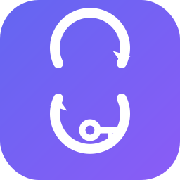

<p align="center">
  
</p>

<h1 align="center">OAuth Switch</h1>

<p align="center">
  <strong>Multi-account switcher for Claude Code, Codex CLI, Kiro, and Windsurf</strong><br/>
  Auto-switch when you hit rate limits. Never waste time waiting again.
</p>

<p align="center">
  <a href="https://github.com/Fei2-Labs/oauth-switch/releases"></a>
  <a href="https://github.com/Fei2-Labs/oauth-switch/blob/main/LICENSE"></a>
  
</p>

---

## What it does

Pool multiple OAuth accounts for **Claude Code** and **OpenAI Codex**, switch between them instantly, and let the tool auto-rotate when usage limits approach. It also shows local read-only quota snapshots for Kiro and Windsurf.

| Feature | Description |
|---------|-------------|
| 🔄 **Instant switch** | One command to swap the active account — by index or alias |
| 📊 **Usage monitoring** | See 5-hour and 7-day utilization per account |
| ⚡ **Auto-switch** | Background daemon rotates to the best account before you hit limits |
| 🖥️ **Menu bar app** | Native macOS app — see status, switch accounts, adjust thresholds |
| 🔔 **Notifications** | macOS alerts when a switch happens |
| 🔑 **Multi-provider** | Claude Code, Codex, Kiro IDE, and Windsurf — all in one tool |
| 🏢 **Enterprise SSO** | Supports Builder ID, Google/GitHub social, and IAM Identity Center |

---

## Quick start

```bash
# Install globally
npm i -g oauth-switch

# Or run directly
npx oauth-switch

# List Claude Code accounts
oas

# List Kiro accounts
oas kiro

# List Codex accounts
oas codex

# Show Windsurf quota
oas windsurf
```

---

## Usage

```bash
# List Claude Code accounts with usage
oas

# Switch to account by index or alias
oas 2
oas work

# Set alias for Claude Code account
oas alias 0 work

# Disable a Claude Code account so auto-switch skips it (enable to undo)
oas disable 2
oas enable 2

# List Kiro accounts
oas kiro

# Switch Kiro account by index or alias
oas kiro 1
oas kiro work

# Set alias for Kiro account
oas kiro alias 0 personal

# List Codex accounts
oas codex

# Add a managed Codex account in an isolated CODEX_HOME
oas codex add

# Switch Codex account by index or alias
oas codex 1
oas codex personal

# Set alias for Codex account
oas codex alias 0 personal

# Disable a Codex account so auto-switch skips it (enable to undo)
oas codex disable 1
oas codex enable 1

# Show Windsurf quota from the local Windsurf state database
oas windsurf

# Show Claude usage (cached while a usage-API 429 backoff is active)
oas usage

# Refresh Codex usage snapshots for all stored accounts (same backoff gate)
oas codex sync-usage

# Bypass the 429 backoff gate (manual escape hatch; a 429 records the next deadline)
oas usage --force
oas codex sync-usage --force

# Run auto-switch check manually
oas auto

# Show the last 50 switch history entries (manual + auto)
oas log

# Sync current account into store
oas sync

# Print the CLI version
oas --version
```

Accounts are captured automatically from local OAuth token files, oauth-switch backup snapshots, and managed Codex homes. Log in with different accounts and run `oas` (or `oas kiro` / `oas codex`) each time. For Codex, run `oas codex add` to create an isolated managed `CODEX_HOME` and keep that account available without replacing the global `~/.codex/auth.json`. Use `oas alias`, `oas kiro alias`, or `oas codex alias` to give accounts memorable names.

---

## Auto-switch

The auto-switch daemon checks usage every 5 minutes and switches to the account with the most remaining quota when thresholds are exceeded.

| Condition | Trigger | Target requirement |
|-----------|---------|-------------------|
| 5h utilization | ≥ 80% | < 60% |
| 7d utilization | ≥ 90% | < 80% |

If all accounts are exhausted, it notifies without switching — unless the current account is genuinely rate-limited (a `rate_limited` flag in the usage response body), in which case it picks the least-bad option.

**HTTP 429 from the usage API is endpoint throttling, not an account limit.** It means the usage API is throttling this machine's polling — it says nothing about the account's quota and never triggers a switch. When a 429 is received, a per-provider backoff deadline is recorded in `~/.oauth-switch/state.json` and zero usage requests are made for that provider until the deadline passes. The backoff is exponential on consecutive 429s — **15 min → 30 min → 60 min (capped at 1 hour)** — and when the response carries a `retry-after` longer than the computed backoff, the longer value wins (still capped at 1 hour). A successful usage fetch resets the streak.

The same backoff gate applies to the manual usage commands (`oas usage`, `cc-switch usage`, `oas codex sync-usage`) and the account listing: while the deadline is active they make zero usage-API requests and render the cached snapshots, printing `Usage API throttled, showing cached data, next attempt at <time>`. Add `--force` to bypass the gate — a genuinely manual escape hatch; a forced request that hits a 429 records the next (doubled) deadline. The menu bar app's timer-driven refresh never passes `--force`.

Both Claude Code and Codex use the same quota-aware target selection: before picking a target, the daemon refreshes usage snapshots and persists them, then picks the viable account with the lowest combined usage (5h weighted 60%, 7d weighted 40%). To keep polling volume low, the **current** account is refreshed every cycle, while **non-current** accounts are only refetched when their snapshot is missing or older than 30 minutes (deduped per credential, so org variants of the same login are fetched once); fully disabled accounts are never polled. A snapshot older than 2 hours is treated as stale and never counts as viable — stale or unknown accounts are only used as a last resort when the current account is rate-limited.

**Anti-ping-pong cooldown:** after a daemon-initiated switch, the daemon will not auto-switch the same provider again for 15 minutes, and the account it switched *from* is excluded as a target for 30 minutes (unless it is the only candidate). Manual switches are never throttled and clear the cooldown for that provider — user intent wins.

If a stored (non-active) Claude account's access token has expired, the daemon automatically refreshes it via the OAuth refresh token and retries the usage fetch, keeping the stored credentials up to date. The live `~/.claude` credentials of the active account are never touched by this refresh; if a refresh fails (e.g. the account was revoked), the previous snapshot is kept and the run continues.

**Credential rotation lifecycle (Claude):** stored refresh tokens rotate — another machine or Claude Code itself can invalidate the copy held in the account pool. To keep dead credentials from ever reaching the live config/Keychain, a manual switch runs a pre-flight: if the target's access token is missing, expired, or expires within 10 minutes, it is refreshed via the OAuth refresh token first, and the fresh tokens are written to every store entry of that credential group before the switch proceeds. If the OAuth endpoint rejects the refresh token (4xx), the switch is blocked — `Cannot switch: credentials for <email> are no longer valid. Log in with this account in Claude Code once to refresh them.` — and the whole credential group is marked `reauth_required`. Marked accounts show ` | re-login` in `oas list` and a red **Re-login** badge in the menu bar app, and are excluded from auto-switch targets (same as disabled accounts). The marker clears automatically as soon as a usage fetch or token refresh for that group succeeds — typically right after you log in with the account in Claude Code once. Network errors and timeouts never set the marker; only a definitive 4xx from the token endpoint does.

Disabled accounts (`oas disable <index>` / `oas codex disable <index>`, or the Disable button in the menu bar app) are never picked as auto-switch targets. Manual switching to a disabled account still works; use `enable` to make it an auto-switch candidate again.

### Install the daemon

```bash
cp com.oauth-switch.auto.plist ~/Library/LaunchAgents/
launchctl load ~/Library/LaunchAgents/com.oauth-switch.auto.plist
```

### Manage

```bash
# Stop
launchctl unload ~/Library/LaunchAgents/com.oauth-switch.auto.plist

# View daemon stdout (every line timestamped)
cat /tmp/oauth-switch-auto.log

# View the persistent switch history (manual + auto)
oas log
```

### Switch history

Every switch is recorded in `~/.oauth-switch/switch.log` as `YYYY-MM-DD HH:mm:ss [source] message`, where the source tag is `[auto]` (daemon-initiated) or `[manual]` (CLI or menu bar app). Besides actual switches, the history records auto-switch "no viable target / staying put / all accounts at capacity" decisions and manual disable/enable actions; routine "usage within limits" checks only go to the daemon stdout log. The file is trimmed to the last ~500 lines once it exceeds ~1 MB. `oas log` prints the last 50 entries.

---

## Menu bar app

A native SwiftUI menu bar app for visual monitoring and one-click switching.

```bash
cd app
make install
open /Applications/OAuthSwitch.app
```

Features:
- Live usage display for Claude/Codex/Windsurf, with menu bar balance display for the selected provider
- Background refresh defaults to 15 minutes (configurable in Settings); usage requests honor the 429 backoff gate and the app never bypasses it with `--force`
- Monochrome provider icons in the menu bar and provider panels
- Expandable provider panels so large account sets stay accessible in the menu bar window
- One-click account switching
- Managed Codex account login from Settings
- Manual refresh from the menu bar
- Menu bar warning threshold and balance source configuration in Settings
- Version footer (`v<version> (<git hash>) <build date>`) in the menu bar window, so you can tell which build is running; `make build` stamps it from `package.json` and git

---

## How it works

```
# Claude Code
~/.claude.json              ← Claude Code reads config from here
~/.claude/.credentials.json ← OAuth tokens live here

# Codex
~/.codex/auth.json          ← Codex OAuth tokens

# Kiro
~/.aws/sso/cache/kiro-auth-token.json  ← Kiro IDE reads tokens from here

# Stores
~/.ClaudeCodeMultiAccounts.json  ← oauth-switch store (Claude)
~/.CodexMultiAccounts.json       ← oauth-switch store (Codex)
~/.KiroMultiAccounts.json        ← oauth-switch store (Kiro)
```

`oauth-switch` snapshots each account's credentials when you use it. Switching replaces the live config files with the stored snapshot and refreshes the token. Restart the CLI/IDE for changes to take effect.

Claude and Codex accounts are keyed by account plus workspace/organization scope. The same login in different workspaces is shown as separate quota entries. Codex expands all organizations embedded in the local OAuth token so one stored login can display multiple workspace rows. Codex auto-detection reads the current `~/.codex/auth.json`, saved oauth-switch snapshots, oauth-switch auth backups, and managed homes under `~/.OAuthSwitch/codex-homes`. Duplicate snapshots with the same OAuth access/refresh token pair in the same workspace/organization are collapsed into one quota entry in the CLI and menu bar app, even if their metadata or account ID differs.

### Managed Codex accounts

`oas codex add` starts `codex login --device-auth` with an isolated `CODEX_HOME` under `~/.OAuthSwitch/codex-homes/<uuid>`. After login, oauth-switch stores that auth snapshot in `~/.CodexMultiAccounts.json`, displays all workspaces embedded in the token, and keeps the managed home available for future refreshes. The macOS Settings window exposes the same flow through **Add Codex Account**.

### Kiro account types

| Type | How to capture |
|------|---------------|
| Builder ID | Log in via Kiro IDE, run `oas kiro` |
| Google/GitHub | Log in via Kiro IDE, run `oas kiro` |
| Enterprise SSO | Log in via Kiro IDE, run `oas kiro` |

Token refresh is handled automatically on switch (OIDC for Builder ID/Enterprise, social endpoint for Google/GitHub).

---

## Project structure

```
oauth-switch/
├── bin/
│   ├── oauth-switch.cjs          # Main CLI entry
│   └── lib/
│       ├── actions/              # list, switch, sync, auto-switch
│       ├── providers/codex.cjs   # Codex provider
│       ├── store/                # IO, account management
│       ├── output/               # Formatting, messages
│       └── usage/                # Fetch, cache, format usage data
├── app/                          # macOS menu bar app (SwiftUI)
├── hooks/                        # Claude Code session hooks
└── com.oauth-switch.auto.plist   # launchd agent config
```

---

## Requirements

- macOS 13+
- Node.js 20+
- Claude Code and/or Codex CLI with OAuth login
- Swift 5.9+ (for building the menu bar app)

---

## License

MIT

---

## Star History

<p align="center">
  <a href="https://star-history.com/#Fei2-Labs/oauth-switch&Date">
    
  </a>
</p>
